## Building an efficient autocomplete index

OpenSearchServer comes by default with a really awesome autocomplete feature working out of the box.

For people wanted to go even further here is a great article for building an efficient autocomplete index that can be tailored to your needs.

###  Creating suggestion terms

First thing to do is thinking about **what the suggestions should be**. It's quite common to **take them from the titles of our documents**. That's what is done by the default `web crawler` template of index that comes with OpenSearchServer:

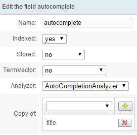

A field called `autocomplete` is created. It **copies its value from the `title` field** and it uses an `AutoCompletionAnalyzer` analyzer. This analyzer is also created by default with the `web crawler` template but can be easily created for index built from scratch.

Default `AutoCompletionAnalyzer` is a good analyzer to use for creating suggestions. Let's review it.

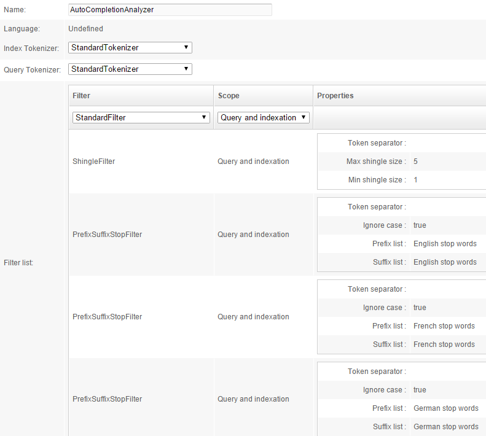

Let's remove all the PrefixuSiffixStopFilter for now. 

Here is the quite simple analyzer: 

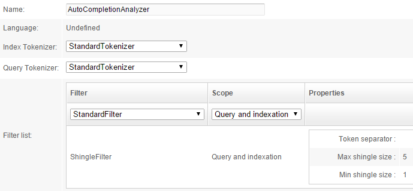

Now let's imagine one indexed article is titled "Pumpkin carving ideas for Halloween!". By copying this value and processing it in this analyzer, field `autocomplete` would index these _tokens_:

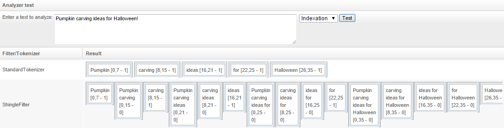

The `ShingleFilter` filter has created tokens by grouping terms together.

These tokens will then become the returned suggestions when querying the autocomplete index.

As you can see some suggestions are not really relevant: _ideas for_, _for_, _for Halloween_. That is where the `PrefixSuffixStopFilter` filter comes handy. It can **delete every _stop words_ from the beginning or the end of a token**. Let's add it:

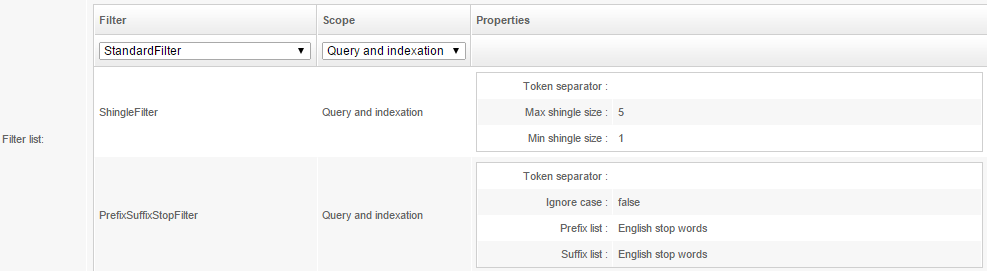

Now, testing the same sentence, we can see that **every suggestion is quite relevant**:

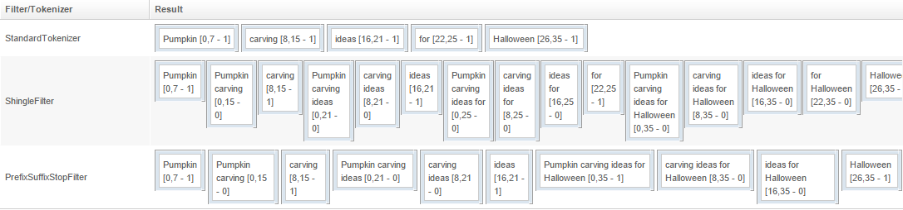

Using this analyzer would give great suggestions. If someone search for instance for  _P_, ..., _Pump_, ..., _Pumpkin_, ... he will get these suggestions:

  * Pumpkin
  * Pumpkin carving
  * Pumpkin carving ideas
  * Pumpkin carving ideas for Halloween
 
Of course this user could also receive others suggestions coming from others articles. And the above suggestions can also come from other articles sharing some of these terms.

---

### Building the autocomplete index

Each time a user writes a letter in the search field, a query must be sent to OpenSearchServer to get back suggestions. With the default embedded autocomplete feature this can be achieved through the [Autocomplete API](../../api_v2/auto-completion/query.md).

Internally, OpenSearchServer uses a _sub-index_ to handle these queries: queries coming from the Autocomplete API **are forwarded to this sub-index as usual _Search queries_.**

> **_Hint_**: this sub-index can easily be _extracted_ (or copied) from the index folder (`<data folder>/<index name>/autocompletion/autocomplete`) and moved up to the root of the OpenSearchServer's _data_ folder. After restarting OpenSearchServer the index will appear in the list!  

> This sub-index can be built (_i.e._ fill) in several ways: when calling the task of scheduler "Build autocompletion", when clicking "Build" in tab Schema / Autocompletion, or when calling the Autocomplete build API.

Whether you choose to extract an existing autocomplete index or to create one from scratch, here is a full description of what this index should be made of.

This index must take its value from the field `autocomplete` described above. We'll see later how it can do this, but for now you need to understand that one document in this index will be one suggestion comming from the `autocomplete` field. Keeping on using the previous example, we would have 10 documents in this new index (_Pumpkin_, _Pumpkin carving_, ..., _Halloween_).

#### Schema of the index

This index has 3 fields:

1. `term`: this field will store suggestions. We'll see in a minute what transformation will be applied to them.
2.  `cluster`: this field will store suggestions in such a way that it can be used to group similar suggestions when returning them (_lower case_, _accent removal_).
3. `freq`: this field will store the frequency of use for the _term_. It will be used to sort suggestions when returning them.

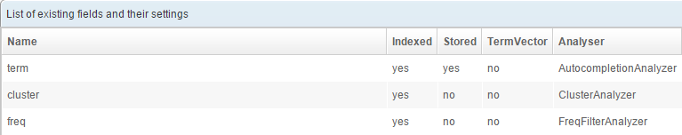 

Each field uses a particular analyzer.

"Default field" must be configured to use field `term` and "Unique field" must be left empty.

##### Analyzer for field `term`

This analyzer holds the _magic_ that is used to search for suggestions from only a few letters.

It is quite easy to understand. Here is its configuration:

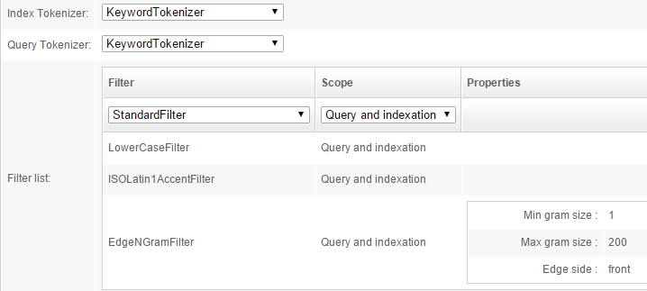 

Tokenizer here do not really _tokenize_ data (_i.e._ split text in words), but rather keep the full text as one expression. A `LowerCaseFilter` is then used, and accents are deleted. Then an `EdgeNGramFilter` is applied to the text. Let's see what it does for expression "Pumpkin carving":

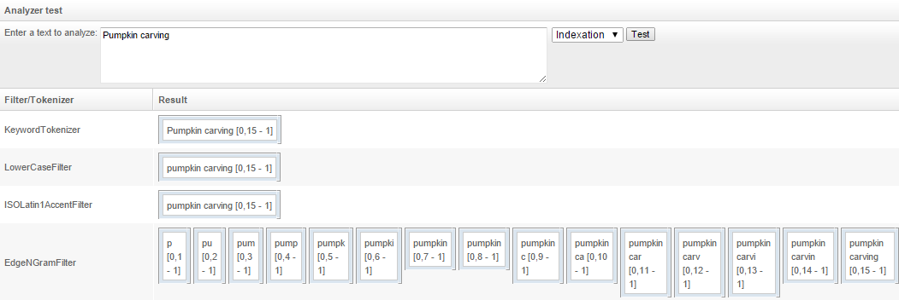 

**Final indexed tokens are all the possible groups of letters**, starting from the beginning of the expression (the _front_ side).

This way, when querying with only a few letters, for example `Pump`, a match can be found with this document! Field `term` being stored (`Stored = yes`), the returned value will be the original expression, "Pumpkin carving". We will see in a moment how the query must be configured.

##### Analyzer for field `cluster`

This field is used to **group similar suggestions when returning results**. For instance, it would not be relevant to return "car" and "Car" as two different suggestions. They must be returned as one suggestion only, since they are the same word using some different case.

Its configuration is basic:

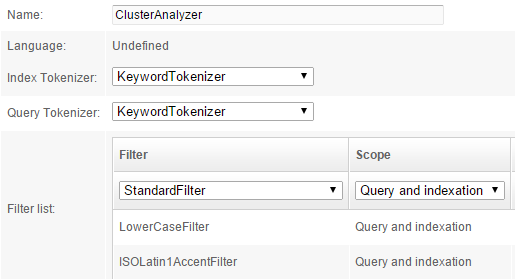 

Using this analyzer, suggestion "Car" would be indexed as "car".

##### Analyzer for field `freq`

We will see in a minute how the frequency of each suggestion can be retrieved. When this frequency is fetched, it comes with a default number format, _i.e._ `24`. As explained in the [How to use analyzers](../indexing/how_to_use_analyzers.md) page, **this format is not suitable for sorting purpose**. Thus, a `NumberFormatFilter` is applied to the frequency value to transform it in a proper value:

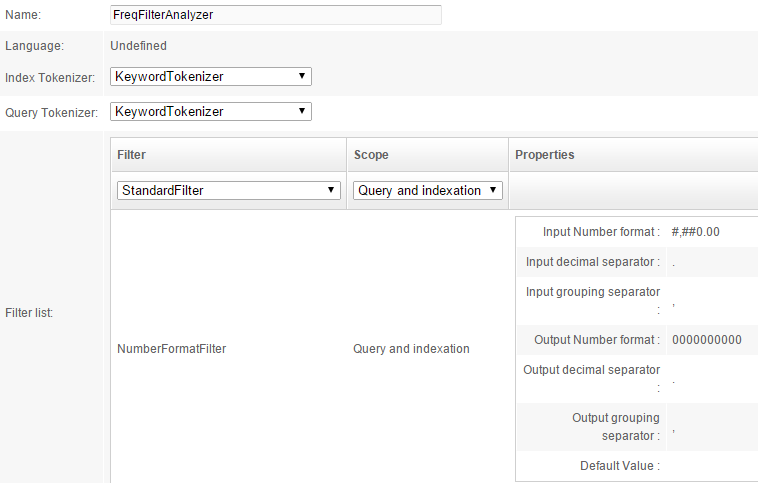

Applied to `24`, this would index `0000000024`:

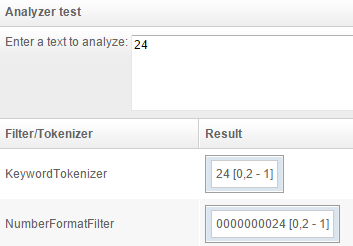 

#### Filling the index

Here comes another great feature of OpenSearchServer!

As we described earlier, suggestions are built in the main index, the one which is really indexing documents. Suggestions are created from the titles of the documents and stored in a particular field of this index (`autocomplete`).

We created another unrelated index to serve as the index that will be queried for suggestions. Thus we need **a way to link those 2 index**: taking value from the `autocomplete` field from the first index to feed the second index and create as many documents as there are suggestions.

This will be done using a job of Scheduler and specifically the **`Pull terms`** task. This task is able to, for each document of a particuler index (called _source_ index):

* fetch values from a particular field and **create one document for each value** found in this field
* **retrieve frequency information** for each term
* copy value from some fields of the source index to the target index

Let's create this job.

> **Warning**: if you extracted an `autocomplete` sub-index from an index, you will need to create this job since it is not included in this sub-index!

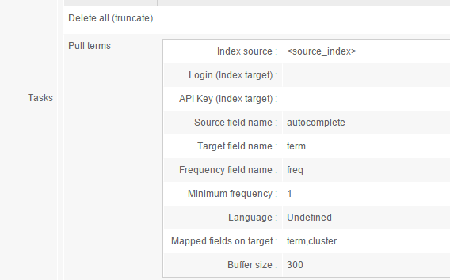 

* Index is first totally emptied,
* Terms are then pulled from a _source_ index
  * the _source_ field is `autocomplete`. For each document, for each value found in this field, a new document will be created in the _target_ index,
  * each value of the `autocomplete` field is copied to the field `term`, 
  * the frequency of each term is copied to the field `freq`,
  * each value is also copied to the field `cluster`.

Running this job will automatically delete all documents from the autocomplete index and build it again with values extracted from the main index. This process can take some time depending of the number of documents in the main index.

---

### Querying the index for suggestions

At last the fun part is there!

We now have a full configured index with data in it. We simply need to configure a query template to return results (suggestions).

Let's create it.

* Query type: **Search (field)**
* Default operator: **AND**
* Number of rows: **10** (for demonstration purpose)
* Returned fields: **term**
* Sorted fields: Field `freq` / Direction `descending` / Empty `last`: this way documents will not be sorted by relevance (default scoring), which would not be useful here, but rather by frequency. The more used terms will come first.
* Collapsing: Mode `cluster` / Type `optimized` / Field `cluster`

And that's hit! Feel free to test it by writing only some letters. You will see that full suggestions, starting by these letters, come back as results.

#### Customizing results

Of course, the whole purpose in doing this is **being able to customize lots of things** in the query. You will for example be able to add some level of sortings (to avoid the random effect that can be seen sometimes in suggestions), forbid some suggestions, use join with others index, etc.
